# Rapport - TP Cloud - Automatisation du Déploiement

## Introduction

Ce rapport documente la résolution des différentes étapes de l'exercice

## 1 - Mise en place du projet

### 1. Configuration du Projet
- Création de la structure de dossiers
- Initialisation du projet Node.js avec package.json
- Configuration des dépendances (Express, pg, dotenv)

### 2. Développement de l'API
- Implémentation du serveur Express de base
- Configuration de la connexion PostgreSQL
- Endpoint `/health` pour vérifier la connectivité base de données

### 3. Schéma de Base de Données
- Création des tables `users` et `products`
- Script d'initialisation avec données d'exemple

### 4. Conteneurisation
- Dockerfile pour le service API
- Utilisation de l'image officielle PostgreSQL
- Configuration Docker Compose pour lancer l'API et la DB localement

### 5. Gestion des Variables d'Environnement
- Fichier `.env` pour la configuration locale
- Variables pour la connexion base de données et port API

### 6. Tests Locaux
- Construction et lancement avec Docker Compose
- Vérification du endpoint `/health`
- Validation de la communication inter-services

### Résultats

> docker-compose up
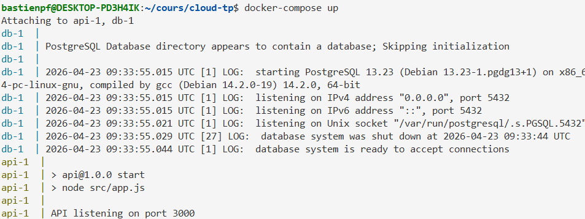

> curl localhost:3000/health
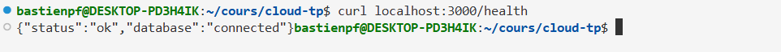

## 2 - Préparation de la VM Azure

### 1 - Initialisation
- mise à jour de la VM (sudo apt update, puis upgrade)
- installation de node via nvm (npmp + node version manager)

### 2 - Installation de Docker et Docker Compose
- suivit de la doc officielle

### 3 - Installation de Kubernetes
- utilisation de Minikube
- suivit de la doc officielle :
  - installation de kubectl
  - utilisation de vm-driver=docker (possibiltié d'utiliser driver=none mais c'est une fonctionnalité avancé avec des risques, et je ne me sent pas en mesure de bien l'utiliser)
  
### Résultat

> installation de nvm (exemple avec màj d'NVM après avoir installé la mauvaise version)
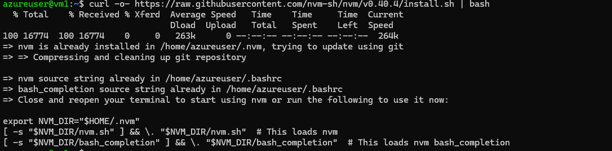
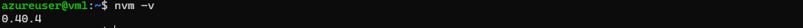

> installation de node 25.9.0
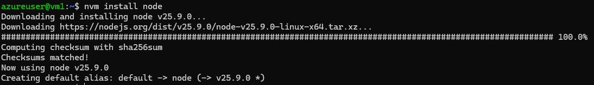

> suivit de la documentation officielle pour l'installation de docker et docker compose (https://docs.docker.com/engine/install/ubuntu/)
> résultats :
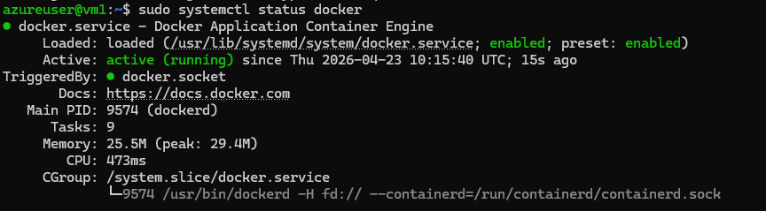
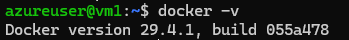
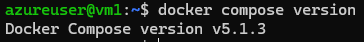
> ajout de l'user au groupe docker pour permettre l'execution de commandes docker sans utiliser sudo (c'est necessaire pour kubernetes, pour pouvoir utiliser minikube avec vm-driver=docker)
> sudo usermod -aG docker $USER

> build docker 
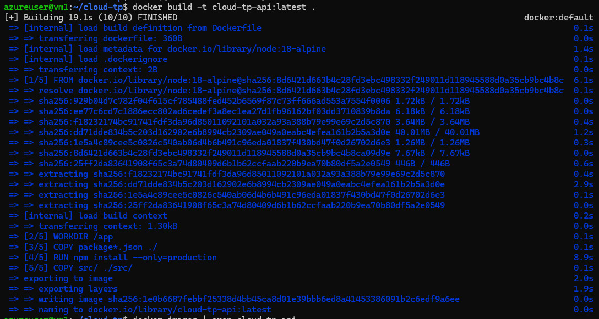

> installation de kubectl (doc officielle : https://kubernetes.io/fr/docs/tasks/tools/install-kubectl/#install-kubectl-on-linux)
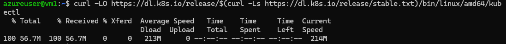
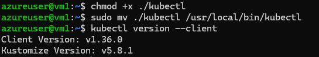

> installation de Minikube
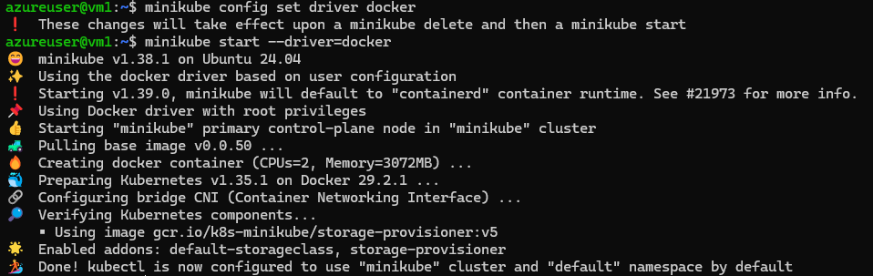

## 3 - Préparation du Déploiement Kubernetes

### 1. Création des Manifestes Kubernetes
- **ConfigMap et Secret** : Configuration des variables d'environnement et secrets pour la base de données
- **PersistentVolumeClaim** : Stockage persistant pour les données PostgreSQL
- **ConfigMap pour l'initialisation DB** : Script SQL d'initialisation intégré dans un ConfigMap
- **Deployment PostgreSQL** : Déploiement du service de base de données avec volumes montés
- **Service PostgreSQL** : Exposition interne du service de base de données
- **Deployment API** : Déploiement de l'application Node.js
- **Service API** : Exposition du service API avec LoadBalancer

### 2. Structure des Manifestes
```
k8s/
├── config.yaml              # ConfigMap et Secret
├── pvc.yaml                 # PersistentVolumeClaim
├── init-db-configmap.yaml   # Script d'initialisation DB
├── postgres-deployment.yaml # Déploiement PostgreSQL
├── postgres-service.yaml    # Service PostgreSQL
├── api-deployment.yaml      # Déploiement API
└── api-service.yaml         # Service API
```

### 3. Script de Déploiement
- Création du script `deploy-k8s.sh` pour automatiser l'application des manifestes
- Ordre d'application respectant les dépendances (config avant déploiements)

### 4. Configuration pour Production
- Utilisation de Secrets pour les mots de passe sensibles
- Variables d'environnement externalisées
- Stockage persistant pour la haute disponibilité
- Service LoadBalancer pour l'accès externe

### Résultats

> deploiment kubernetes
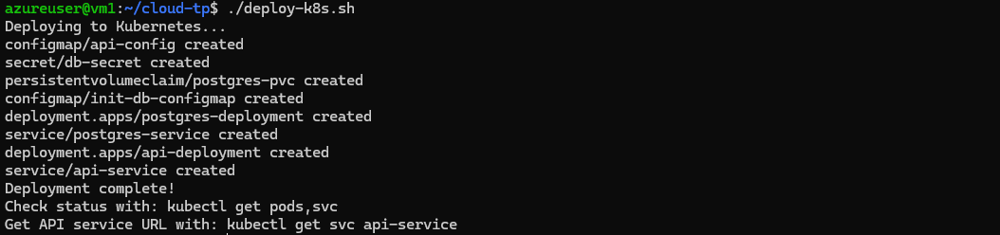

> verification du déploiment (localement)
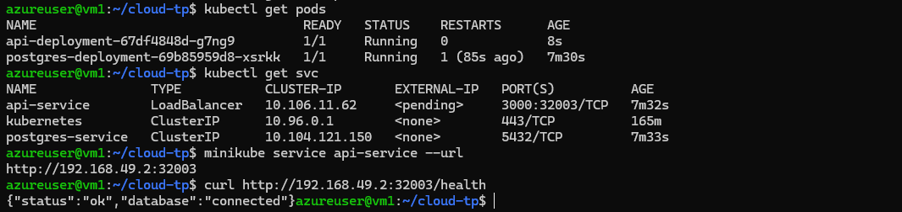

> ajout d'une règle inbound sur le port 3000 pour ma VM Azure


> utilisation de kubectl port forwarding pour acceder à l'API avec l'IP de la VM comme url :
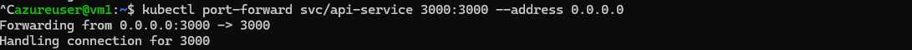
accès depuis ma machine locale
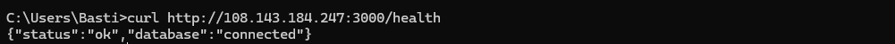

-> pourquoi faire ce port forwarding ? 
- plus simple que la mise en place d'un serveur apache et de la modification des fichiers de configuration

## 5 - Mise en place du Pipeline CI/CD

### 1. Configuration GitHub Actions
- Création du workflow `.github/workflows/deploy.yml`
- Configuration des déclencheurs automatiques (push sur main/master)
- Séparation en jobs : test-and-build et deploy

### 2. Pipeline Automatique
Le pipeline suit le flux suivant :
```
git push → CI/CD → Installation dépendances → Tests → Build Docker → Push image → Déploiement VM → Mise à jour Kubernetes
```

### 3. Étapes du Pipeline

#### Job 1: test-and-build
- **Installation des dépendances** : `npm ci` pour installation propre
- **Exécution des tests** : `npm test` (placeholder pour l'instant)
- **Build Docker** : Construction de l'image API
- **Push vers Registry** : Envoi vers GitHub Container Registry

#### Job 2: deploy (uniquement sur main/master)
- **Connexion SSH à la VM** : Utilisation des secrets GitHub
- **Mise à jour de l'image** : Modification du manifest Kubernetes
- **Application des changements** : `kubectl apply -f k8s/`
- **Vérification du déploiement** : Rollout status et vérification des pods

### 4. Secrets et Variables d'Environnement
Configuration des secrets dans GitHub :
- `AZURE_VM_HOST` : IP publique de la VM Azure
- `AZURE_VM_USER` : Nom d'utilisateur SSH
- `AZURE_VM_SSH_KEY` : Clé privée SSH pour l'accès au server azure

### 5. Gestion des Échecs
- **Arrêt automatique** : Pipeline échoue si les tests échouent
- **Pas de déploiement manuel** : Tout est automatisé
- **Logs détaillés** : Disponibles dans l'onglet Actions de GitHub

### Résultats

> Configuration du workflow GitHub Actions
> le déploiement sur la VM dans la pipeline avait des difficultées.
Pour palier à celles ci, j'ai créé une nouvelle pair de clées publiques / privées, nommées 'github_action'.
J'ai autorisé la clée publique dans la VM (~/.ssh/authorised_keys) et j'ai copié la clé privée dans mes secrets github
J'ai aussi copié le nom de mon user azure, et l'IP publique de la VM dans les secrets githubs
creation d'un clée ssh pour github action et copie sur la VM
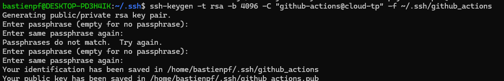
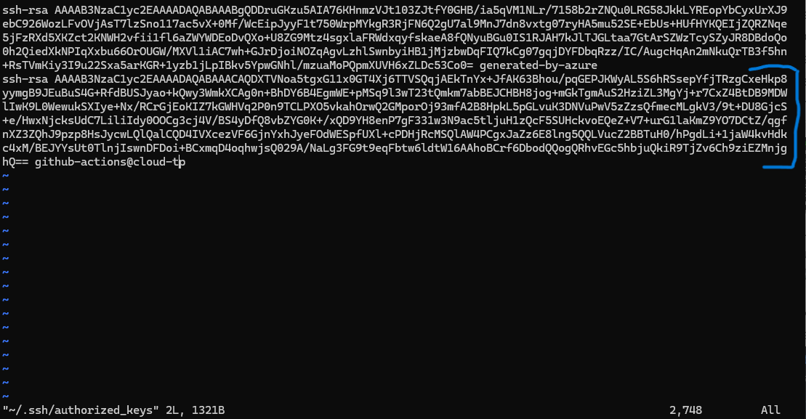

> Exécution automatique du pipeline :
"test and build" s'execute sans erreurs
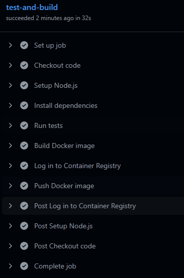

> le déploiement sur la VM a toujours des difficultées
En effet, mes secrets ne marchent pas. J'arrive a me connecter en local en utilisant la clée privé 'github_action', mais quand je copie son contenu dans un secret github, elle n'est pas récupéré par lors du CI-CD
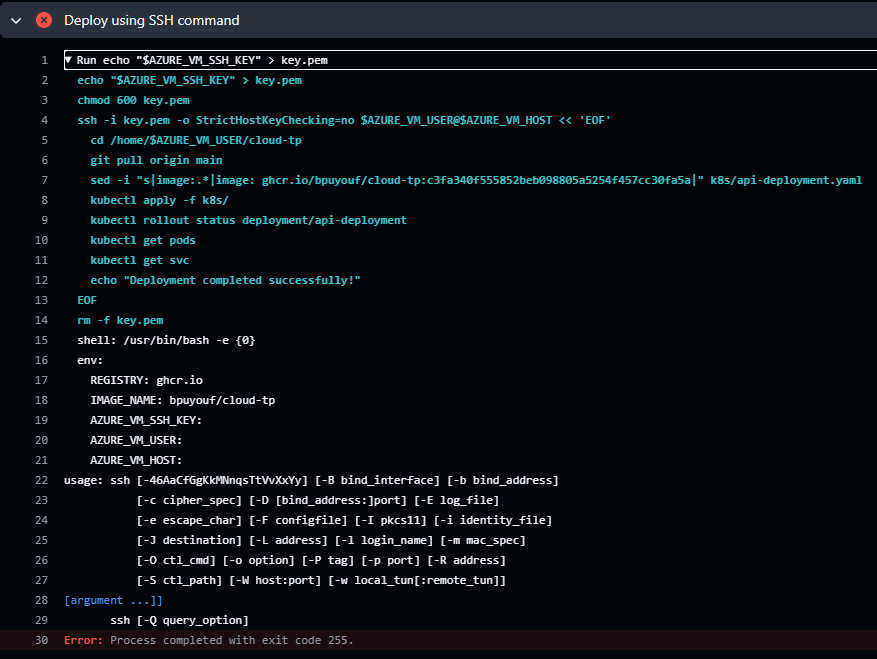

> je me suis apperçu que j'avais une passphrase définie sur la clée, ce qui empechait le script de fonctionner. J'ai refait une clée sans passphrase et j'ai ajouté cette dernière à tout le workflow
> malgrès cette modification, le workflow ne marche toujours pas lorsqu'il faut se connected à la VM